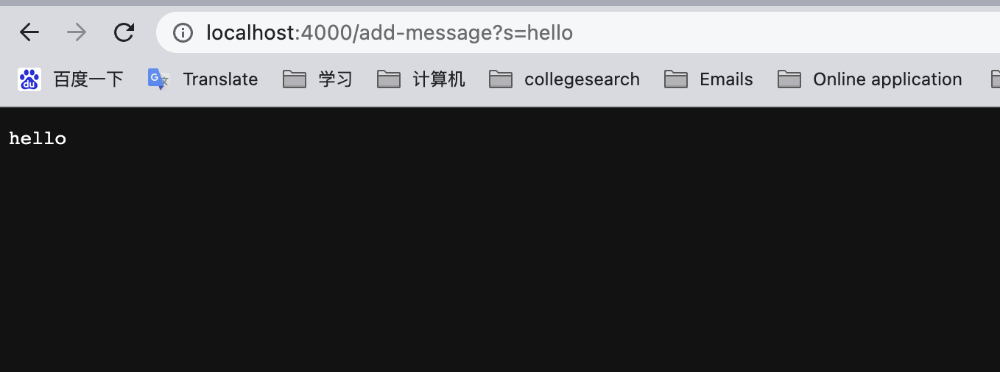
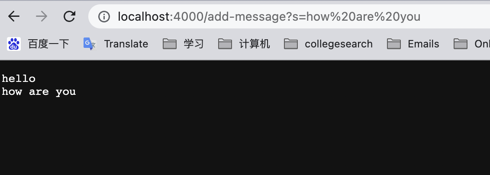
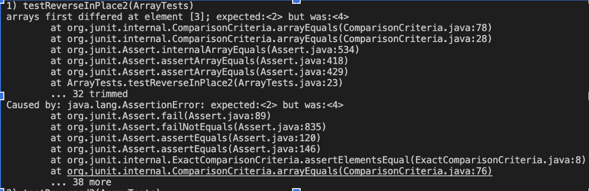
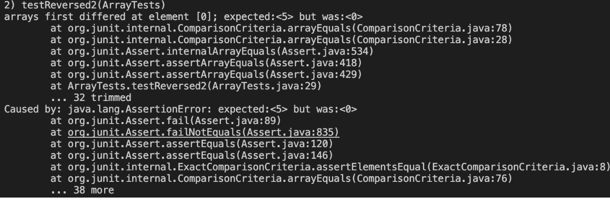

# Lab Report2
---
## CODE
In first method, the main parts is the part in the first else if segment. This part of code finds keyword"add-message" and add the keywords after "=" to the parameter list of current server. Everytime an item is added to the list, the server is supposed to print out all the elements added to the list. So I use a for loop to add every elements and "\n" to the string and return that String. And that is the final out put of that url.

`idx:` number of arguments already in the components list

`comp` array that store the elements added to the server

`res` the String that contains all the elements added and the newly added element, with a "\n" after each element

```
import java.io.IOException;
import java.net.URI;

class Handler implements URLHandler {
    // The one bit of state on the server: a number that will be manipulated by
    // various requests.
    int num = 0;

    String[] comp = new String[100000];
    int idx = 0;
    public String handleRequest(URI url) {
        if (url.getPath().equals("/")) {
            String listing = "";
            if (idx == 0) return "Nothing added yet";
            for (int i = 0; i < idx; i++){
                listing += comp[i];
                listing += " ";
            }
            return listing;
        } 
        else if (url.getPath().contains("/add-message")) {
            String[] parameters = url.getQuery().split("=");
            if (parameters[0].equals("s")) {
                // num += Integer.parseInt(parameters[1]);
                comp[idx++] = parameters[1];
                String res = "";
                for (int i = 0; i < idx; i++){
                    res += comp[i];
                    res += "\n";
                }
                return String.format("%s", res);
            }
        }
        return "404 Not Found";
    }
}

public class StringServer {
    public static void main(String[] args) throws IOException {
        if(args.length == 0){
            System.out.println("Missing port number! Try any number between 1024 to 49151");
            return;
        }

        int port = Integer.parseInt(args[0]);

        Server.start(port, new Handler());
    }
}
```

The main method of this class enable the server to run while enable this server with function described above


## Screenshots of results
1. `idx:` number of arguments already in the components list

2. `comp` array that store the elements added to the server

3. `res` the String that contains all the elements added and the newly added element, with a "\n" after each element


in the screenshot above, both the urlhandler method and the main method are triggered. After inputping the url with *add-message?s=...* the url handler will add element after "s=" to the comp list. And a for loop will put every element together and put them into a String res. and res will be print.

This image follows the exact same process as the upper one.


# failure inducing input of Code

```
static void reverseInPlace(int[] arr) {
  for(int i = 0; i < arr.length; i += 1) {
    arr[i] = arr[arr.length - i - 1];
  }
}

static int[] reversed(int[] arr) {
  int[] newArray = new int[arr.length];
  for(int i = 0; i < arr.length; i += 1) {
    arr[i] = newArray[arr.length - i - 1];
  }
  return arr;
}
```

## Testcase that induce eror
```
@Test 
public void testReverseInPlace2() {
  int[] input1 = {1,2,3,4};
  ArrayExamples.reverseInPlace(input1);
  assertArrayEquals(new int[]{4,3,2,1}, input1);
}

@Test
public void testReversed2() {
  int[] input1 = {1,2,3,4,5};
  assertArrayEquals(new int[]{5,4,3,2,1}, ArrayExamples.reversed(input1));
}
```

## Testcases that doesn't induce error
```
@Test 
public void testReverseInPlace() {
  int[] input1 = { 3 };
  ArrayExamples.reverseInPlace(input1);
  assertArrayEquals(new int[]{ 3 }, input1);
}


@Test
public void testReversed() {
  int[] input1 = { };
  assertArrayEquals(new int[]{ }, ArrayExamples.reversed(input1));
}
```

## Symptoms
**didn't reverse the list as expected**


**didn't reverse the list as expected**



## Bugs fixing
ReverseInPlace fixing strategy
*Before*
```
// Changes the input array to be in reversed order
static void reverseInPlace(int[] arr) {
  for(int i = 0; i < arr.length; i += 1) {
    arr[i] = arr[arr.length - i - 1];
  }
}
```

*After* 
1. Added a temp that ensure proper value swap of two elements
2. divided the loop time by two so that it won't swap every element for two times
```
static void reverseInPlace(int[] arr) {
    for(int i = 0; i < arr.length/2; i += 1) {
      int temp;
      temp = arr[arr.length-i-1];
      arr[arr.length-i-1] = arr[i];
      arr[i] = temp;
    }
  }
```

Reversed Fixing
*Before*
```
static int[] reversed(int[] arr) {
  int[] newArray = new int[arr.length];
  for(int i = 0; i < arr.length; i += 1) {
    arr[i] = newArray[arr.length - i - 1];
  }
  return arr;
}
```

*After*
1. The returned array and modified array should be newArray but not arr. After changing that, the program runs fine.
```
static int[] reversed(int[] arr) {
  int[] newArray = new int[arr.length];
  for(int i = 0; i < arr.length; i += 1) {
    newArray[i] = arr[arr.length - i - 1];
  }
  return newArray;
}
```


# Summary
In week 2 and 3's lab report, I learn to handle http request and get information from the url. Beside that, I learn to write test cases using Junit test and debug respectively. It is hard sometimes, but I learnt a lot.
